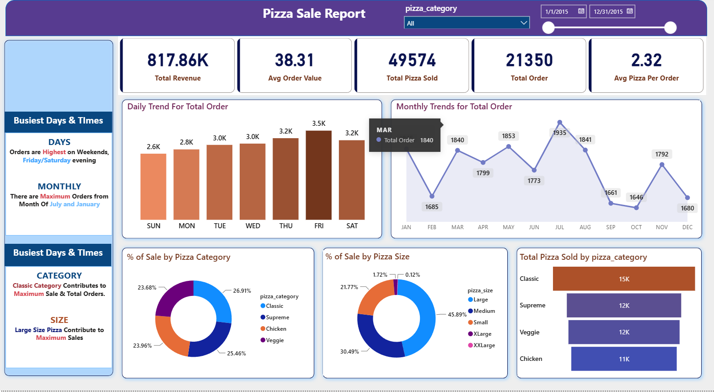
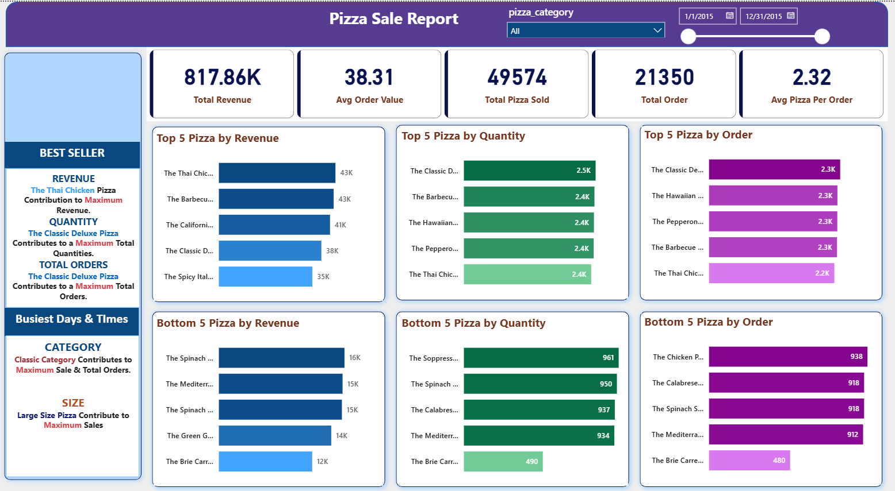

# 🍕 Pizza Sales Analysis Dashboard | Power BI
## 📷 Dashboard Preview

### Dashboard - Page 1

---

### Dashboard - Page 2

## 📌 Project Overview

This project presents an interactive end-to-end Business Intelligence (BI) dashboard developed using Microsoft Power BI. Using a comprehensive pizza sales dataset, the dashboard transforms raw transactional data into meaningful business insights by analyzing revenue trends, customer purchasing patterns, product performance, and overall sales efficiency. The report enables stakeholders to monitor key performance indicators (KPIs) and make data-driven business decisions through interactive visualizations.

---

## 📈 Key Metrics & Data Insights

- **Business Performance:** Tracks Total Revenue, Total Orders, Total Pizzas Sold, Average Order Value, and Average Pizzas per Order to provide a complete overview of sales performance.
- **Sales Trend Analysis:** Monitors daily and monthly sales trends to identify peak business periods and seasonal demand patterns.
- **Product Performance:** Highlights the best-selling and lowest-performing pizzas based on sales volume and revenue contribution.
- **Category & Size Analysis:** Evaluates sales distribution across pizza categories and sizes to understand customer preferences and optimize inventory planning.
- **Business Intelligence:** Delivers actionable insights that support pricing strategies, product optimization, and operational decision-making.

---

## 🛠️ Technical Implementation & Features

- **Data Preparation:** Cleaned and transformed raw sales data using Power Query to ensure consistency and improve reporting accuracy.
- **Data Modeling:** Established relationships between multiple tables to create a scalable and efficient data model.
- **DAX Measures:** Developed custom measures for KPIs, sales analysis, averages, and business calculations.
- **Interactive Dashboard:** Designed dynamic reports using slicers, filters, cards, and charts for seamless user interaction.
- **Visualization Design:** Created an executive-style dashboard with KPI cards, trend analysis, category comparisons, and product performance visuals for effective business reporting.

---

## 📂 Repository Structure

- **Pizza sale 1(BI).pbix** – Complete Power BI dashboard and data model.
- **dashboard-preview.png** – Dashboard screenshot for quick visualization.
- **README.md** – Project documentation and technical overview.
